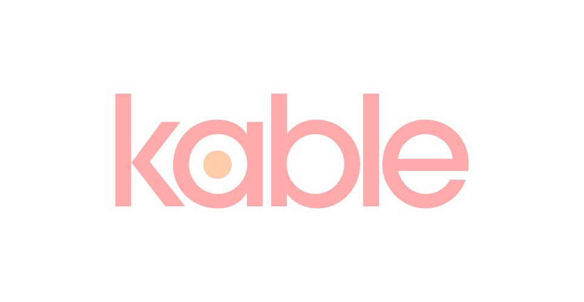

<p align="center">
	
</p>

# Kable

A helper to manage kubernetes specs in a GitOps fasion. 

## What it does


## Usage

```
~ 
❯ kable        
Usage:
   [command]

Available Commands:
  app         Create/Update app from concepts
  concept     Interact with concepts of a repository
  help        Help about any command
  repo        Add/List/Remove concept repositories for kable
  serve       Run kable as a server
  version     Show version information

Flags:
  -c, --config string   config file (default is $HOME/.config/kable/settings.json)
  -h, --help            help for this command
  -t, --toggle          Help message for toggle

Use " [command] --help" for more information about a command.
```

### Concept

A concept is a blueprint of an app. It is written in a specific language can be rendered to various outputs.

Supported Types:
* Jsonnet
* JavaScript/Typescript (upcoming)

Each concept needs to build on its own, that's why there is no dependency concept in kable. If let's say a Jsonnet concept depends on another Jsonnet concept, this should be realized via the Jsonnet-specific package management.

### App

An app is an instance of a concept, it's "Application" so to say. An App specifically is rendered from a concept. Multiple output targets are supported.

Supported Targets:
* YAML
* Argo Applicaiton (upcoming)
* FluxCD Application (upcoming)

### Repo 

A repo is a git repository which contains an index of concepts at its root. Thus, a repo can serve as a platform for exchange of concepts.
